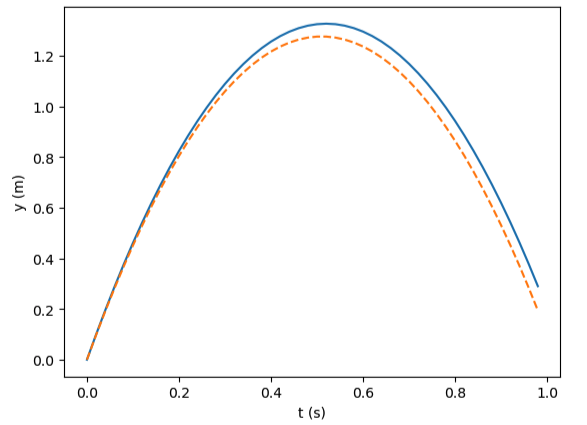

# Euler's Method
Imagine you don't have an explicit formula for the motion you're describing. You know only the initial conditions (position and velocity) and the forces at play. 
(If you know the force and the mass of the object, you also know the acceleration.)

Using a time step ```h```, we calculate the position and velocity of the object after a time step ```h``` has passed.

**For example, consider:**
```python
x₀ = 0
v₀ = 0
a = const.
```

We calculate the position and velocity after one time step using the initial velocity, initial position, and acceleration. Assuming velocity is approximately constant through a small time step, we find the position after one time step as:

**Position after one time step:**
```python
x₁ = x₀ + v₀ * h
```

**Velocity after one time step:**
```python
v₁ = v₀ + a * h
  ```

Now the position after one time step is x₁, and the velocity is v₁.

**We repeat:**
```python
x₂ = x₁ + v₁ * h  
v₂ = v₁ + a * h
```

Essentially, at every step, position and velocity are approximated by using the first two terms in the Taylor expansion of their exact formulas.

Things to Note:
* With this method, the main source of error comes from the approximation of a constant velocity during each time step. Over time, the error accumulates and grows larger.

* Small errors happen at every step because the real motion is curved (due to acceleration), but Euler’s method treats it as straight lines (linear).

* The asymmetry in using only the initial velocity to update position during a time step, ignoring velocity changes within that step, also adds to the error.

* This error tends to accumulate over time because there is no correction mechanism.
  
* Euler’s method is less accurate over longer times or larger time steps. Using smaller time steps reduces the error per step but requires more computation.

Applying this to free fall:
```python
import matplotlib.pyplot as plt

g = 9.8 # gravity
y = 0.0 # initial position
v0 = 5.0 # initial velocity
ta = [] # time array for plotting
ya = [] # position array for plotting
t = 0.0 # time
h = 0.02 # step size
yb = [] # holds analytic solution for position under constant acceleration

while t<1.0:
    ta.append(t)
    ya.append(y)
    yb.append(v0*t-g*t*t/2.0) # analytic solution
    v = v0 - g*t # calculate v(t)
    y = y + v*h # Euler's method
    t = t + h

plt.figure() # start a figure
plt.plot(ta, ya, ta, yb, '--') # draw 2nd curve as dashed
plt.xlabel('t (s)')
plt.ylabel('y (m)')
plt.show()
```


Here, the analytical solution is represented by the orange dashed line, and Euler's method is represented by the blue line. Notice that the error grows over time, showing the limitations of Euler's method.
