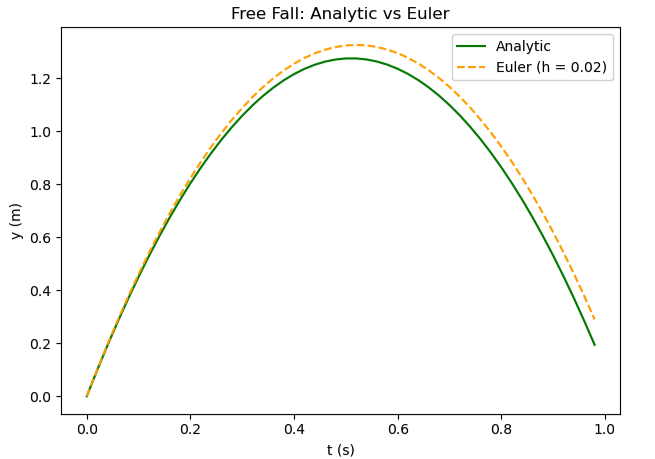

# Euler's Method
Euler's method is a numerical technique that is used to approximate analytic solutions to ordinary differential equations (ODEs). It is a first-order method⁺, meaning the global error is proportional to the time step size.

<pre>
  slope of function at (t, y): dy/dt = f(t, y)
  initial condition: y(t₀) = y₀
</pre>
The goal is to estimate ```y(t)``` in discrete time steps ```h``` using the slope of function at the current point (t, y) ```dy/dt = f(t, y)```.

The recursive algorithm:
<pre>
   yₙ₊₁ = yₙ + f(tₙ, yₙ) * h
</pre>
We are moving to the next small discrete time step by walking along the current slope.

Imagine you don't have an explicit formula for the motion you're describing. You know only the initial conditions (position and velocity) and the forces at play. 
(If you know the force and the mass of the object, you also know the acceleration.)

**For example, consider:**
```python
  x₀ = 0
  v₀ = 0
  a = const.
```

We calculate the position and velocity after one time step using the initial velocity, initial position, and acceleration. Assuming velocity is approximately constant through a small time step, we find the position after one time step as:

**Position after one time step:**
```python
  x₁ = x₀ + v₀ * h
```

**Velocity after one time step:**
```python
  v₁ = v₀ + a * h
  ```

Now the position after one time step is x₁, and the velocity is v₁.

**We repeat:**
```python
  x₂ = x₁ + v₁ * h  
  v₂ = v₁ + a * h
```

Things to Note:
* With this method, the main source of error comes from the approximation of a constant velocity during each time step. Over time, the error accumulates and grows larger.

* Small errors happen at every step because the real motion is curved (due to acceleration), but Euler’s method treats it as straight lines (linear).

* The asymmetry in using only the initial velocity to update position during a time step, ignoring velocity changes within that step, also adds to the error.

* This error tends to accumulate over time because there is no correction mechanism.
  
* Euler’s method is less accurate over longer times or larger time steps. Using smaller time steps reduces the error per step but requires more computation.

Applying this to free fall:
```python
import matplotlib.pyplot as plt
# --- Constants
g = 9.8 # Gravity
h = 0.02 # Time Step
v0 = 5.0 # Initial Velocity

# --- Variables
t = 0.0 # Time
y = 0.0 # Initial Position

# --- Analytic Solution
ta = []
ya = []
while t < 1.0:
    ta.append(t)
    ya.append(v0 * t - (1/2) * g * t * t)
    t = t + h
    
# --- Euler's Method
tb = []
yb = []
v = v0
y = 0.0 # Initial Position Reset
t = 0.0 # Time Reset
while t < 1.0:
    tb.append(t)
    yb.append(y)
    y = y + v * h
    v = v - g * h
    t = t + h

# --- Graph
plt.figure()
plt.plot(ta, ya,label="Analytic", color="green")
plt.plot(tb, yb, '--',label="Euler (h = 0.02)", color="orange")

plt.xlabel('t (s)')
plt.ylabel('y (m)')
plt.title("Free Fall: Analytic vs Euler")
plt.legend()
plt.tight_layout()
plt.show()
```


Here, the analytical solution is represented by the green solid line, and Euler’s method is shown as the orange dashed line. Notice that the error grows over time, showing the limitations of Euler's method.


### ⁺ "Okay, but what is a first order approximation method?"
Euler's method is a first order approximation method, meaning that:
* Error per step is proportional to the square of the step size ```h²``` (local error)
* Total error accumulated is proportional to the step size ```h``` (global error)

Since the global error scales by ```h```, it is called a first order method.

Order of a method is how fast the error shrinks when you decrease the size of a time step:
* Euler's method is first-order - h¹ --> decrease time step by x2 = error decreases by x2
* RK2 method is second-order - h² --> decrease time step by x2 = error decreases by x4
* RK4 method is fourth-order - h⁴ --> decrease time step by x2 = error decreases by x16
