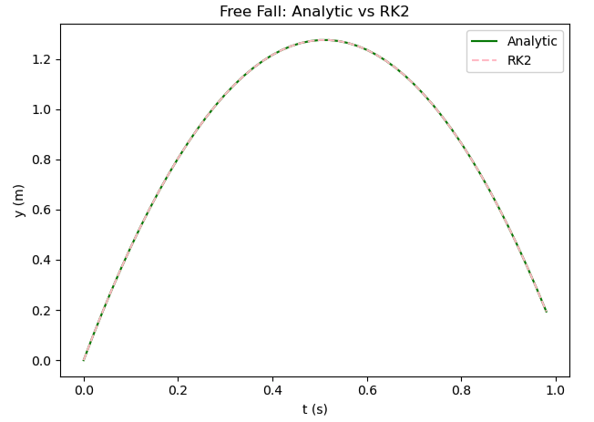

# Runge-Kutta 2 (RK2)
Similar to Euler's method, RK2 is  a recursive algorithm used to approximate analytic solutions to ODEs. However, in this method there is an embedded error correction mechanism. This method is called second-order because the global error scales as ```h²```, which is an improvement from Euler’s method.

Instead of using the slope of the function in the beginning of the time interval, RK2 uses the slope midway through the time step, which serves as a better approximation of the average slope over that time interval.
<pre>
  slope of function at (t, y): dy/dt = f(t, y)
  initial condition: y(t₀) = y₀
</pre>
The goal is to estimate ```y(t)``` in discrete time steps ```h``` using the slope of function halfway through the time interval (t + h/2, y) ```dy/dt = f(t + h/2, y)```.

The recursive algorithm:
<pre>
    Estimate the slope at current point:
    k1 = f(tₙ, yₙ)
  
    Estimate y at mid point:
    ymid = yₙ + k1 * h/2

    Estimate slope at mid point:
    k2 = f(tₙ, ymid)

    Estimate y at end point:
    yₙ₊₁ = yₙ + k2 * h
</pre>

For our free fall problem, it would look like:
```python
vmid = v - g * (h/2)
y = y + vmid * h
v = v - g * h
```
Applying this to free fall:
```python
import matplotlib.pyplot as plt
# --- Constants
g = 9.8 # Gravity
h = 0.02 # Time Step
v0 = 5.0 # Initial Velocity

# --- Variables
t = 0.0 # Time
y = 0.0 # Initial Position

# --- Analytic Solution
ta = []
ya = []
while t < 1.0:
    ta.append(t)
    ya.append(v0*t - (1/2)*g*t*t)
    t = t + h

# --- Runge-Kutta 2
td = []
yd = []
v = v0
y = 0.0 # Initial Position Reset
t = 0.0 # Time Reset
while t < 1.0:
    td.append(t)
    yd.append(y)
    vmid = v - g*(h/2)
    y = y + vmid*h
    v = v - g*h
    t = t + h

# --- Graph
plt.figure()
plt.plot(ta, ya,label="Analytic", color="green")
plt.plot(td, yd, '--', label="RK2", color="pink")

plt.xlabel('t (s)')
plt.ylabel('y (m)')
plt.title("Free Fall: Analytic vs RK2")
plt.legend()
plt.tight_layout()
plt.show()
```


Here, the analytical solution is represented by the green solid line, and the RK2 method is shown as the pink dashed line. As we can see, the graphs coincide much more acccurately compared to Euler's method.
