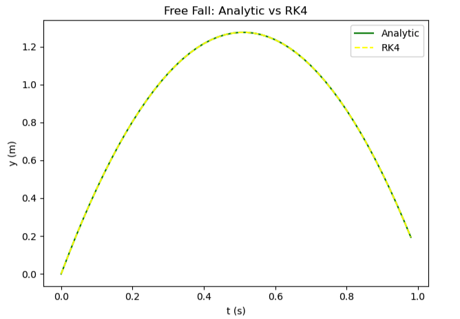

# Runge-Kutta 4 (RK4)
This method is quite similar to RK2, but this time the slope used to estimate y(t) is a weighted average of the slopes at the beginning, middle and the end of the time step, which gives a more accurate estimate for the average slope over that time step. This method is called fourth-order because the global error scales as ```h⁴```, which is an improvement from Euler’s method and RK2.

The recursive algorithm:
<pre>
    Estimate the slope at current point:
    k1 = f(yₙ, tₙ)

    Estimate slope at mid point:
    k2 = f(yₙ + k1 * h/2, tₙ + h/2)
    
    Estimate slope at mid point using k2:
    k3 = f(yₙ + k2 * h/2, tₙ + h/2)

    Estimate slope at end point using k3:
    k4 = f(yₙ + k3 * h, tₙ + h)

    Estimate y at end point using the weighted average of slopes:
    yₙ₊₁ = yₙ + (h/6) * (k1 + 2*k2 + 2*k3 + k4)
</pre>

Applying this to the free fall problem:
``` python
import matplotlib.pyplot as plt
# --- Constants
g = 9.8 # Gravity
h = 0.02 # Time Step
v0 = 5.0 # Initial Velocity

# --- Variables
t = 0.0 # Time
y = 0.0 # Initial Position

# --- Analytic Solution
ta = []
ya = []
while t < 1.0:
    ta.append(t)
    ya.append(v0*t - (1/2)*g*t*t)
    t = t + h
    
# --- Runge-Kutta 4
te = []
ye = []
v = v0
y = 0.0 # Initial Position Reset
t = 0.0 # Time Reset
while t < 1.0:
    te.append(t)
    ye.append(y)
    k1 = v
    k2 = v - g * (h/2)
    k3 = v - g * (h/2)
    k4 = v - g * h
    y = y + (h/6) * (k1 + 2*k2 + 2*k3 + k4)
    v = v - g*h
    t = t + h

# --- Graph
plt.figure()
plt.plot(ta, ya,label="Analytic", color="green")
plt.plot(te, ye, ':', label="RK4", color="red")

plt.xlabel('t (s)')
plt.ylabel('y (m)')
plt.title("Free Fall: Analytic vs RK4")
plt.legend()
plt.tight_layout()
plt.show()
```

